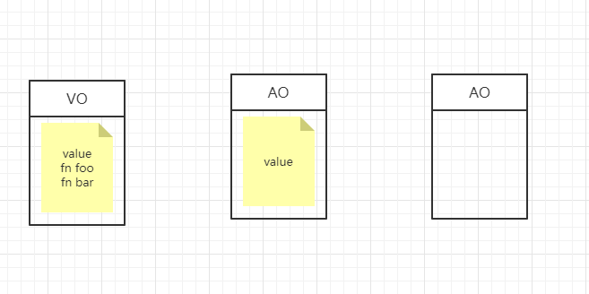
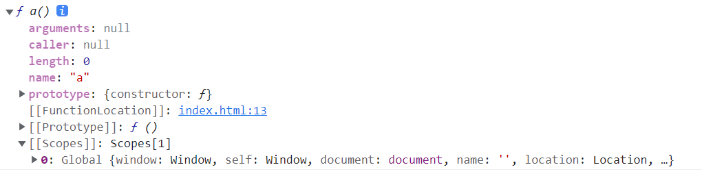
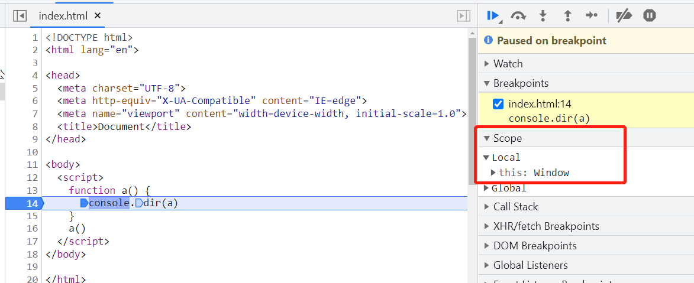
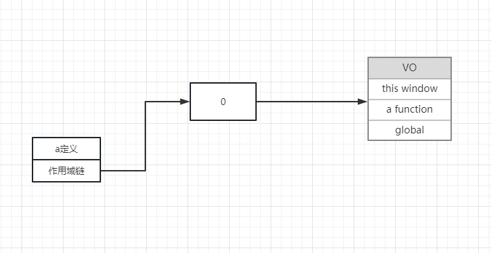
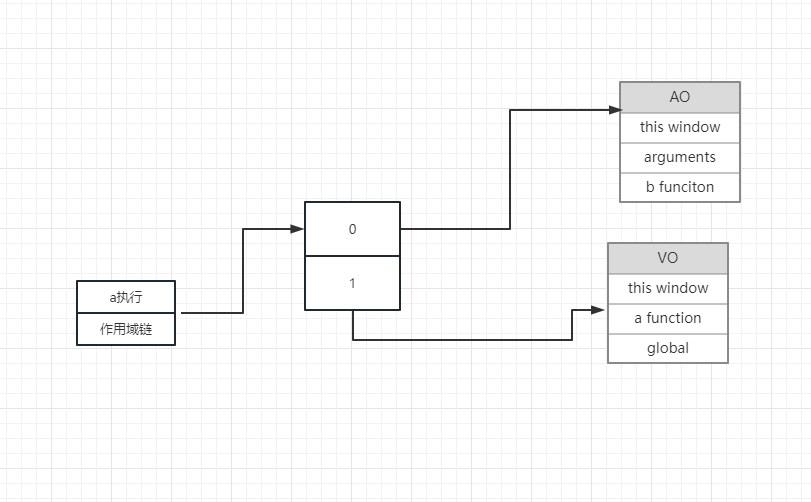
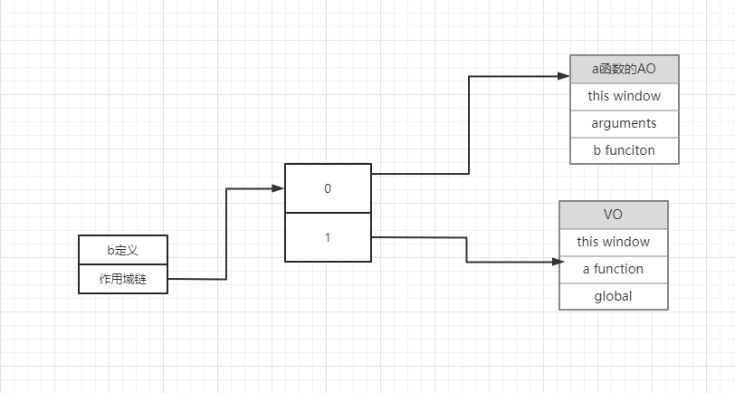
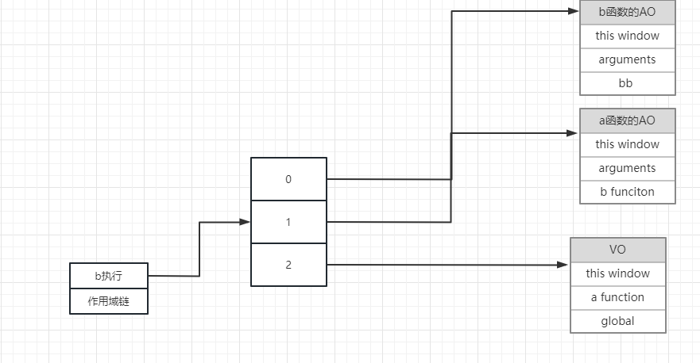
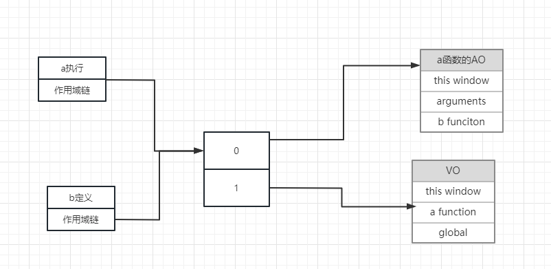
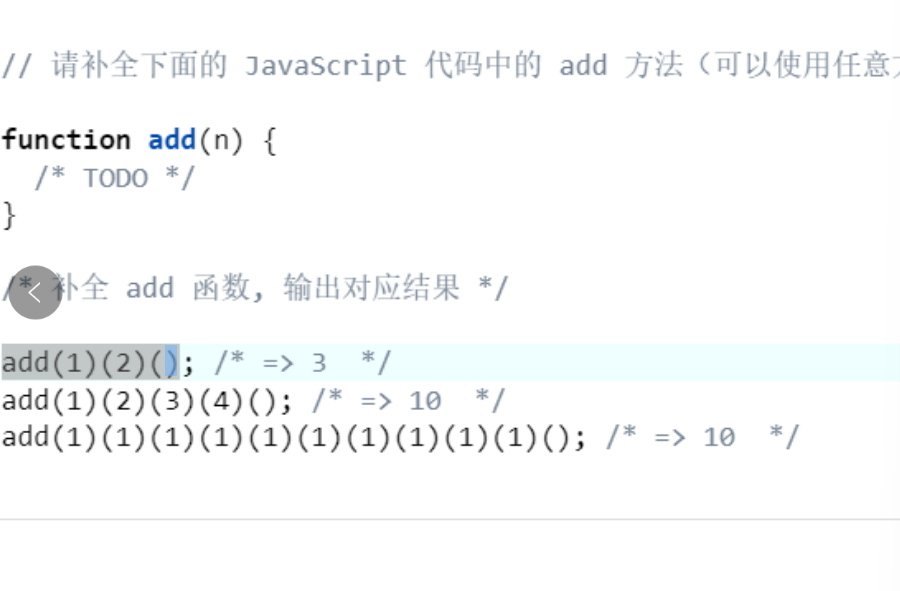

# 作用域
作用域是指程序源代码中定义的范围
作用域规定了如何设置变量，也就是确定当前执行代码对变量的访问权限
JavaScript采用词法作用域，也就是静态作用域

- 所谓词法作用域就是在函数定义的时候 就已经确定了
```js
var value = 1;
function foo() {
    console.log(value);
}

function bar() {
    var value = 2;
    foo();
}

bar();   // 1
```
- 变量对象
变量对象是当前代码段中，所有的变量(变量 函数 形参 arguments)组成的一个对象
变量对象是在执行上下文中被激活的，只有变量对象被激活了，在这段代码中才能使用所有的变量
变量对象分为全局变量对象和局部变量对象
全局简称为 Variable Object VO 函数由于执行才被激活 称为 Active Object AO
```js
var value = 1;
function foo() {
    console.log(value);
}

function bar() {
    var value = 2;
    foo();
}

bar();   // 1
```


# 作用域链
在js中, 函数存在一个隐式属性 [[scopes]], 这个属性用来保存当前函数的执行上下文环境, 由于在数据结构上是链式的, 因此也被称作是作用域链, 我们可以把它理解为一个数组
可以理解为是一系列的AO对象所组成的一个链式结构

```js
function a(){}
console.dir(a) // 打印结构

```


- 当函数被调用后
```js
function a(){
  console.dir(a)
}
a()
```
- a函数的执行上下文如下

因此我们可以得出一个结论: [[scopes]] 属性在函数声明时产生, 在函数调用时更新
即: 在函数被调用时, 将该函数的AO对象压入到[[scopes]]中


# 作用域链的作用
作用域链的作用是保证执行环境里有权访问的变量和函数是有序的，作用域链的变量只能向上访问，变量访问到window对象即被终止，作用域链向下访问变量是不被允许的

最直观的表现就是:
- 函数内部可以访问到函数外部声明的变量
```js
var a = 100
function fn(){
  console.log(a)
}
fn() // 100
```

- 函数外部访问不到函数内部的变量
```js
function fn() {
  var a = 100
}
fn()
console.log(a) // a is not defined
```


# 画出下面代码执行的作用域链
```js
    var global
    function a() {
      var aa = 123
      function b() {
        var bb = 234
      }
      b()
    }
    a()
```

- 第一步 a函数生成 


- 第二步 a函数调用


- 第三步 b函数生成 （a函数调用导致b函数生成）


- 第四步 b函数调用


# 函数执行完就销毁 所谓销毁就是断掉图中的线 

# 思考 a函数调用 和 b函数生成是不是同一个作用域链 
- 是的 下面代码验证
```js
var global
    function a() {
      // 到这个里面来了 
      var aa = 123
      // b函数定义
      function b() {
        // 到这里面来了 
        var bb = 234
        aa = 0
      }
      // b执行
      b()
      console.log(aa);
    }
    // a执行 
    a()
    // 打印aa的结果 如果是00 说明是同一个 没有分离 
```

- 那么就有了下面的图解



# 看看闭包
```js
var global
    function a() {
      // 到这个里面来了 
      var aa = 123
      // b函数定义
      function b() {
        console.log(aa);
      }
      return b
    }
    // a执行 
    var res = a()
    res()
```
- 底层原理结合图9 讲解 

# 经过上述的讲解 那么谈谈闭包的定义
- 就是能够读取其他函数内部变量的函数。
- 能够实现 函数外部 访问到函数内部的变量 

# 闭包的实战应用
- 回调函数
```js
function add(num1, num2, callback) {
    var sum = num1 + num2;
    if (typeof callback === 'function') {//类型判断，确认是一个函数
      callback(sum);
    }
}

add(1, 2, function (sum) {
  console.log(sum);
})
// 是一个闭包吗？
// 含义：就是能够读取其他函数内部变量的函数。

```
- 手写实现 bind
```js
// getName 的 this指向foo对象
let foo = {
  name: 'jill'
}
function getName () {
  console.log(this.name)
}
Function.prototype.myBind = function (obj) {
  // 将当前函数的this 指向目标对象
  let _self = this
  return function () {
    return _self.call(obj)
  }
}
 
let getFooName = getName.myBind(foo)
getFooName() // jill
```

- 防抖节流函数

- 单例模式

- 经典笔试题

```js
function add(n) {
    if (!n) { return res } // 要是整个结果  6  10 
    res = n
    return function (n) {
      // 这一次传的参数 应该是 上面几次的和
      return add(res + n)
    }
  }

  console.log(add(1)(2)(3)()); // 6
  console.log(add(1)(2)(3)(4)()); // 10

```
- 定时器传参

```js
    function fn(a) {
      return function () {
        console.log(a)
      }
    }

    setTimeout(fn(123), 1000)
```

- 私有变量

```js
var getter , setter 
(function(){
  var privateA = 0
  getter = function(){
    return privateA
  }
  setter = function(){
    if(typeof newVal !== 'number'){
      throw new Error('不是number类型')
    }
    privateA = newVal
  }
})();
```

# 利用闭包判断数据类型
```js
function isType(type) {
  return function (target) {
    return `[object ${type}]` === Object.prototype.toString.call(target)
  }
}

const isArray = isType('Array')
console.log(isArray([1, 2, 3]));				// true
console.log(isArray({}));	

```


企业级项目

js的水平 不要因为面试 临时抱佛脚 


